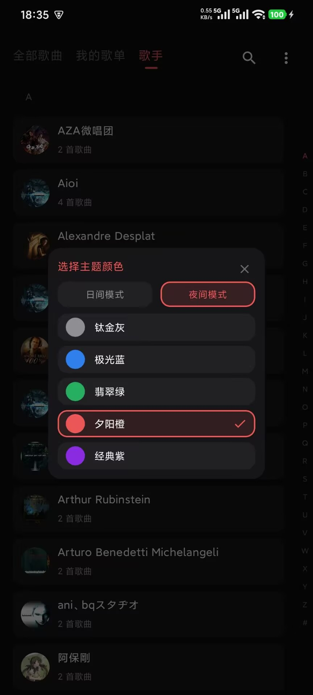

# AI-Player

AI-Player 是一款基于 Jetpack Compose 和 Material 3 开发的高颜值、现代化的本地 Android 音乐播放器。

---

## 📱 界面预览

  
  
  
  
  

  从左至右依次为：全部歌曲、正在播放、我的歌单、歌手列表、主题设置

---

## ✨ 核心功能

- 🎵 **音乐播放与动效**
  - 精美的唱片（黑胶）旋转播放动画。
  - 底部律动频谱仪（LiveVisualizer）动画。
  - 支持高音质品质标识（Hi-Res / HQ / SQ）自动识别与显示。
  - 支持歌单随机播放、单曲循环、列表循环等多种播放模式。
- 📂 **音乐库管理**
  - **全部歌曲**：自动扫描并管理本地音频文件，实时显示歌曲数量。
  - **我的歌单**：支持“喜欢歌单”、“遗忘的沙漏”等预置歌单，支持新建及删除自定义歌单，支持歌单的导入与导出。
  - **歌手分类**：基于拼音自动按 A-Z 首字母进行歌手分类，并提供便捷的右侧字母检索边栏。
- 🎨 **个性化主题与日夜模式**
  - 完美支持**日间模式**与**夜间模式**。
  - 支持一键切换多种精致的主题颜色：**钛金灰**、**极光蓝**、**翡翠绿**、**夕阳橙**、**经典紫**。
- ⚙️ **其他实用功能**
  - **睡眠定时**：支持设置播放定时关闭。
  - **本地扫描与屏蔽**：支持手动扫描本地音乐，并可设置屏蔽文件夹，避免杂乱的系统音频（如语音消息、通知音）混入歌单。

---

## 🛠️ 技术栈

- **开发语言**：Kotlin
- **UI 框架**：Jetpack Compose, Material Design 3
- **媒体服务**：Jetpack Media3 (PlaybackService / PlaybackManager)
- **数据库**：SQLite (MusicDatabaseHelper)
- **架构模式**：MVVM (ViewModel + States + Clean architecture patterns)
- **辅助库**：PinyinHelper 拼音转换与索引排列

---

## 结语

没有一行代码是自己写的，甚至README都不是，我花一天时间用屎一样的提示词都能把APP做成这个样子，AI确实让开发门槛变得非常低
